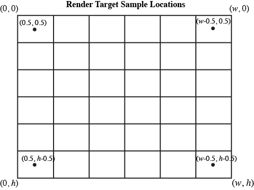
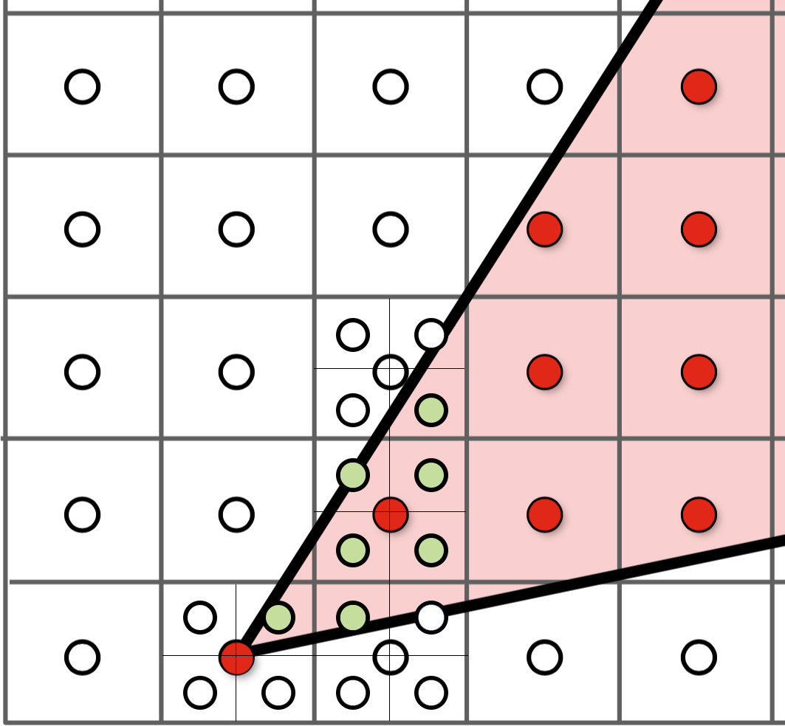

# Project 1: Rasterizer

Trong bài tập này, bạn sẽ cài đặt một công cụ rasterizer đơn giản, bao gồm các tính năng như vẽ hình tam giác, supersampling (super sampling), biến đổi phân cấp (hierarchical transforms) và texture mapping cùng với khử răng cưa. Cuối cùng, bạn sẽ có một trình kết xuất đồ họa vector là một phiên bản đơn giản hóa của 1 trình vẽ tệp SVG (Scalable Vector Graphics), được sử dụng rộng rãi trên internet.

Project có 6 Task, tương ứng với các tuần thực hành như sau:

week 2:
- Task 1: Vẽ hình tam giác một màu (20 điểm)
- Task 2: Khử răng cưa bằng Supersampling (20 điểm)

Week 3:
- Task 3: Biến đổi (10 điểm)
- Task 4: Tọa độ trung tâm (10 điểm)

Week 4:
- Task 5: "Lấy mẫu pixel" để lập bản đồ họa tiết (15 điểm)
- Task 6: "Lấy mẫu nhiều mức độ" với mipmap để lập bản đồ kết cấu (25 điểm)
- Phần 7: Bonus - Vẽ một cái gì đó sáng tạo!

# Getting started

Hãy setup project này như các bạn đã làm ở hw_0(https://github.com/Computer-graphics-INT3403/hw_0)

Note: Để tránh tạo hình ảnh bị nén làm giảm chất lượng khi submit bài, chỉ lưu ảnh chụp màn hình ở dạng PNG thay vì JPG hoặc các định dạng khác! Do ảnh PNG được nén mà không mất mát dữ liệu.

1 số tài nguyên sau hữu ích:

Hướng dẫn C ++ về một số mẹo và thủ thuật nhanh để bắt đầu với C ++ [ở đây](https://cs184.eecs.berkeley.edu/sp21/docs/cp-intro). Hướng dẫn C ++ chi tiết hơn một chút có thể được tìm thấy [tại đây](https://github.com/Bryce-Summers/Writings/blob/master/Programming%20Guides/C_plus_plus_guide.pdf).

Cách hình ảnh được biểu diễn trong máy tính [tại đây](https://cs184.eecs.berkeley.edu/sp21/docs/images-as-data).

các hàm và kiểu dữ liệu vector và ma trận trong thư viện CGL [tại đây](https://cs184.eecs.berkeley.edu/sp21/docs/cgl-primer).

danh sách đầy đủ các API của thư viện CGL Vectors [tại đây](https://cs184.eecs.berkeley.edu/sp21/docs/cgl-vector-docs).

##Giao diện GUI

Bạn có thể chạy tệp thực thi bằng lệnh
```bash
./draw [đường dẫn đến tệp / thư mục svg để hiển thị]
```
Ví dụ: bạn có thể chạy lệnh này:
```bash
./draw ../svg/basic/test1.svg
```

Lưu ý: Đối với Visual Studio, thư mục đầu ra có độ sâu 3 level. 
Do đó, bạn nên sử dụng `./draw ../../../svg/basic/test1.svg`.
Nếu dùng terminal để build trên Linux / Unix / Mac, câu  lệnh phải chạy trước 1 level: `./draw ../svg/basic/test1.svg`.

Bạn sẽ thấy một bông hoa bao gồm các chấm màu xanh lam. 
Hầu hết các tệp SVG khác sẽ không hiển thị chính xác cho đến khi bạn hoàn thành các task.
Dưới đây là các phím tắt có sẵn (một số phím tắt phụ thuộc vào việc bạn cài đặt các phần khác nhau của bài tập)

Key	Action

|space|	return to original viewpoint|
|-----|-----------------------------|
|- |giảm sample rate|
|= |tăng sample rate|
|Z |bật tính năng pixel inspector|
|P |chuyển qua lại các filtering methods trên pixels|
|L |chuyển qua lại các filtering methods trên mipmap|
|S |lưu lại ảnh màn hình PNG vào thư mục working directory|
|1 - 9|chuyển qua lại giữa các file svg|

tham số được truyền vào `./draw` để vẽ có thể là một tệp duy nhất hoặc một thư mục chứa nhiều tệp svg, vd:
```
./draw ../svg/basic/
```

Nếu bạn tải một thư mục có tối đa 9 tệp, bạn có thể chuyển đổi giữa các tệp đó bằng cách sử dụng các phím số 1-9 trên bàn phím của mình.

## Làm quen với cấu trúc project

Hầu hết các sửa đổi của bạn được giới hạn trong các hàm của các file `rasterizer.cpp`, `transforms.cpp` và `texture.cpp`.
Ngoài việc sửa đổi những hàm này, bạn sẽ cần phải hiểu các source code file và header file khác khi bạn code.
ví dụ, code cho bài tập này và các bài tập trong tương lai sử dụng thư viện CGL.
Đối với bài tập này, bạn có thể quen với các lớp được định nghĩa trong `vector2D.h`, `matrix3x3.h` và `color.h`.

Sau là mô tả ngắn gọn về những gì sẽ xảy ra khi bạn chạy chương trình `draw`: `SVGParser` (trong `svgparser.h` / `cpp`) đọc (các) tệp svg đầu vào, khởi chạy OpenGL Viewer có chứa trình kết xuất `DrawRend` (trong `drawrend.h / cpp`), vào một vòng lặp vô hạn và chờ đầu vào từ chuột và bàn phím. Trong hàm `DrawRend::redraw()`, việc vẽ các hình được
thực hiện bởi các lớp `SVGElement` khác nhau (trong `svg.h / cpp`), sau đó chuyển dữ liệu điểm, đường và tam giác đến các phương thức thích hợp của lớp `Rasterizer`.

## Một ví dụ đơn giản: Vẽ điểm
Bạn được cung cấp 1 đoạn code để vẽ các điểm 2D. để hiểu cách chương trình hoạt động, 
xem hàm `SVG::draw()` trong `svg.h`. Đối tượng SVG vẽ tất cả các phần tử trong tệp SVG thông qua một chuỗi các lệnh gọi hàm `draw()`. Mỗi loại phần tử gọi một hàm vẽ tương ứng trong class `Rasterizer`. 
Trong trường hợp của kiểu phần tử Point, `Point::draw()` sẽ được gọi bên trong `RasterizerImp::rasterize_point()` trong file `rasterizer.cpp`.
Vị trí của các phần tử SVG trong tệp SVG được xác định bằng tọa độ cục bộ trong trục tọa độ,
vì vậy `Point::draw()` chuyển vị trí của điểm thành tọa độ màn hình trước khi 
chuyển nó đến `RasterizerImp::rasterize_point()`.

Hàm `RasterizerImp::rasterize_point()` chịu trách nhiệm vẽ điểm. 
Trong bài tập này, chúng ta sẽ vẽ lên màn hình có kích thước (target_w,target_h) như sau:

- (0, 0) tương ứng với phía trên bên trái của hình ảnh đầu ra

- (target_w, target_h) tương ứng với góc dưới bên phải của hình ảnh đầu ra

Hãy giả sử rằng các vị trí pixel trên màn hình nằm ở tọa độ 1/2 số nguyên trong không gian màn hình.
Nghĩa là, pixel trên cùng bên trái ở tọa độ (0,5, 0,5) và
pixel dưới cùng bên phải ở tọa độ (target_w-0,5, target_h-0,5). 


Để rasterize các điểm, 
chúng ta áp dụng quy tắc sau: 
một điểm bao phủ nhiều nhất một pixel màn hình: 
pixel gần nhất với tọa độ sẽ được tô màu theo màu tọa độ. 
Điều này được thực hiện như sau,
giả sử (x, y) là tọa độ không gian màn hình của một điểm cần vẽ.
```c++
int sx = (int) floor(x);
int sy = (int) floor(y);
```
Nếu `sx`,`sy` thuộc màn hình, chúng ta điền vào pixel bằng màu RGB được liên kết với điểm (x,y) đó.
```c++
rgb_framebuffer_target[3 * (y * width + x)    ] = (unsigned char)(c.r * 255);
rgb_framebuffer_target[3 * (y * width + x) + 1] = (unsigned char)(c.g * 255);
rgb_framebuffer_target[3 * (y * width + x) + 2] = (unsigned char)(c.b * 255);
```
(Lưu ý: Trong bài tập này, chương trình không hỗ trợ tính trong suốt (alpha), mặc dù đây là một phần của định dạng tệp SVG.)

# Project Tasks
## Week 2:
### task 1: Vẽ hình tam giác một màu
Bài giảng liên quan: [2](https://cs184.eecs.berkeley.edu/sp21/lecture/2/digital-drawing)

Trong task này, bạn sẽ cài đặt hàm `rasterize_triangle` 
trong `rasterizer.cpp`. Solution của bạn nên:

- Rasterize các tam giác bằng cách sử dụng các phương pháp lấy mẫu 
được mô tả trong bài giảng.
  
- Đối với mỗi pixel, thực hiện kiểm tra xem điểm đó có thuộc tam giác hay không bằng cách kiểm tra điểm trung tâm của pixel, 
không phải điểm ở góc. Tọa độ kiểm tra của bạn phải bằng một số nguyên cộng với (.5, .5).

- Trong Phần 2, bạn sẽ cài đặt super sampling bằng pixel phụ(sub-pixel), 
  nhưng ở đây bạn chỉ nên lấy mẫu một lần cho mỗi pixel và gọi hàm `fill_pixel()`.
  Làm theo ví dụ trong hàm `rasterize_point`.
  
- Để nhận full điểm, chú ý các rìa của tam giác phải được vẽ chính xác. Bạn được khuyến khích nhưng không bắt buộc 
  xử lý các pixel nằm chính xác trên một cạnh. Đảm bảo rằng không có cạnh nào của bạn không được rasterize.

- Việc cài đặt của bạn ít nhất phải hiệu quả bằng cách chỉ lấy mẫu trong 
  hình hộp giới hạn của hình tam giác (không chỉ mỗi pixel trong toàn bộ khung hình).
code của bạn nên vẽ hình tam giác bất kể thứ tự quanh co của các đỉnh (tức là theo chiều kim đồng hồ hay ngược chiều kim đồng hồ). Kiểm tra `svg/basic/test6.svg`.
  
Khi hoàn tất, bạn sẽ có thể hiển thị các tệp SVG thử nghiệm với các đa giác một màu 
(được ghép bằng các hình tam giác ở vị trí khác nhau. Các tệp `basic/test3.svg`, `basic/test4.svg`, `basic/test5.svg` 
và `basic/test6.svg` sẽ hiển thị chính xác.

Để thuận tiện, đây là danh sách các hàm bạn sẽ cần sửa đổi:

1. Hàm `RasterizerImp::rasterize_triangle()` `trong rasterizer.cpp`.

Bonus: Làm cho hàm rasterize tam giác của bạn siêu nhanh (ví dụ: bằng cách loại các phép toán số học dư thừa ra khỏi các vòng lặp, 
giảm thiểu truy cập bộ nhớ và 
không phải kiểm tra mọi pixel trong hộp giới hạn). Viết về các tối ưu hóa bạn đã sử dụng. Sử dụng `clock()` hoặc 
`std ::chrono::high_resolution_clock` để so sánh thời gian chính xác giữa các cài đặt đơn giản và phương pháp tối ưu hóa của bạn.

### Task 2: Khử răng cưa bằng Supersampling

Relevant lecture: [3](https://cs184.eecs.berkeley.edu/sp21/lecture/3/sampling-aliasing-and-antialiasi)

Sử dụng Supersampling để khử răng cưa các hình tam giác của bạn. Tham số `sample_rate` trong `DrawRend` 
(được điều chỉnh bằng phím - và =)
cho bạn biết số lượng mẫu cần sử dụng trên mỗi pixel.

Hình ảnh bên dưới cho thấy cách lấy mẫu bốn lần trên mỗi 
pixel tạo ra kết quả tốt hơn so với chỉ lấy mẫu một lần
. Supersamplingu trong tam giác tạo ra cạnh mịn hơn.


Để cài đặt supersampling, vui lòng lấy mẫu tại các vị trí của grid `sqrt(sample_rate) * sqrt(sample_rate)` 
được mỗi pixel. (`sample_rate` là một biến con của class `RasterizerImp`)

Một cách hợp lý để nghĩ về supersampling chỉ đơn giản là rasterize 1 hình ảnh có độ phân giải cao hơn,
sau đó resize hình ảnh có độ phân giải cao hơn xuống độ phân giải đầu ra của bộ đệm khung.

Hàm `fill_pixel` ban đầu được sử dụng trong task 1 trực tiếp vẽ vào bộ đệm khung,
nhưng để lấy mẫu Supersampling, trước tiên bạn nên vẽ vào `sample_buffer`, điền vào tất cả các subpixel tương ứng với pixel đầu ra.

Pipeline tổng thể của rasterizer:

1. SVGParser đọc tệp svg thành 1 instant của SVG.
2. Khi bắt đầu rasterize, trình kết xuất (`DrawRend::redraw`) gọi hàm `SVG::draw`.
3. `SVG::draw` gọi các hàm rasterize đường / tam giác / điểm cụ thể để tạo hình ảnh.
4. `DrawRend::redraw` gọi rasterize đường để vẽ ranh giới hình vuông.
5. `DrawRend::redraw` gọi `RasterizerImp::resolve_to_framebuffer()` để dịch bộ đệm bên trong của trình rasterizer 
   sang bộ đệm màn hình để hình ảnh có thể được hiển thị và ghi thành tệp.

Gợi ý cho task này:

- Bạn sẽ cần quản lý bộ nhớ thích hợp để lưu trữ dữ liệu supersampling của mình. Nên sử dụng biến `RasterizerImp::sample_buffer` (trong`rasterizer.h`) 
  cho mục đích này. Phụ thuộc vào thuật toán của bạn, 
  nhưng có khả năng kích thước của sample buffer của bạn cần sẽ phụ thuộc vào kích thước bộ đệm khung (thay đổi khi cửa sổ được thay đổi kích thước) 
  và supersampling rate(thay đổi theo các lần nhấn phím như mô tả ở trên). 
  Bạn sẽ cần cập nhật động kích thước của bộ đệm.
  Có các gợi ý bên dưới và trong code nơi bạn có thể muốn quản lý kích thước bộ đệm của mình.

- Xóa các giá trị trong bộ nhớ đệm mẫu và/hoặc bộ đệm khung một cách thích hợp 
  khi bắt đầu vẽ lại khung. Thao tác xóa khung hình trước khi
  bạn bắt đầu vẽ.
- Cập nhật hàm `rasterize_triangle` của bạn để 
  thực hiện supersampling vào bộ nhớ đệm supersampling của bạn. 
  Việc sắp xếp dữ liệu trong bộ đệm supersampling của bạn là tùy thích.
  
    - Dựa trên cách bạn cài đặt supersampling, 
      sample buffer của bạn chỉ là bộ đệm khung tạm thời nhưng 
      có độ phân giải cao hơn.
      Ví dụ: supersampling 4x4 với bộ đệm khung hình 1000x1000 pixel có
      nghĩa là đưa hình ảnh 4000x4000 (độ phân giải cao) vào sample buffer.
      Sau khi bạn rasterize hình ảnh có độ phân giải cao,
      bạn cần giảm sample buffer xuống 1000x1000 pixel 
      bằng cách lấy trung bình lưới 4x4 của các giá trị mẫu có 
      liên quan đến mỗi pixel đầu ra. 
      Theo cách suy nghĩ này, bạn cần phải lưu trữ nhiều bộ nhớ hơn 
      để thực hiện quá trình rasterize supersampling 
      có độ phân giải cao.
      (Kiểm tra sự hiểu biết của bạn: bạn có thể đạt được kết quả tương tự 
      mà không cần thêm bộ nhớ không, và nếu vậy, 
      sự đánh đổi của kỹ thuật đó là gì?)

- Khi kết thúc việc rasterize tất cả các hình, bạn sẽ cần điền bộ đệm
  khung hình từ các supersampling sample buffer của mình.Lưu ý rằng khi hàm `RasterizerImp::resolve_to_framebuffer`
  được gọi là bước cuối cùng trong việc hiển thị khung trong drawrend.cpp, 
  vì vậy bạn có thể muốn triển khai phần này của thuật toán tại đây.
  
- Lưu ý rằng bạn sẽ cần chuyển đổi giữa các kiểu dữ liệu màu khác nhau.
  `RasterizerImp::rgb_framebuffer_target` lưu trữ một con trỏ đến dữ liệu pixel bộ đệm khung hình được vẽ lên màn hình.
  `rgb_framebuffer_target` là một mảng các giá trị 8 bit cho mỗi thành phần R, G và B của màu sắc của mỗi pixel - 
  đây là định dạng dữ liệu nhỏ gọn được hầu hết các hệ thống đồ họa dùng để vẽ lên màn hình. 
  Ngược lại, biến `RasterizerImp::sample_buffer` mà chúng tôi khuyên bạn nên sử dụng cho bộ nhớ supersampling của mình 
  là một mảng các đối tượng Màu R, G và B dưới dạng các giá trị float. 
  Bạn có thể cần chuyển đổi giữa các kiểu dữ liệu này. Chú ý các lỗi chuyển đổi dấu phẩy động thành số nguyên, chẳng hạn như làm tròn và tràn số.
  
- Bạn có thể sẽ thấy các điểm và đường không còn hiển thị chính xác
  sau khi sửa đổi supersampling.
  Các đường và điểm không được lấy supersampling,
  nhưng chúng vẫn cần được vẽ vào vùng đệm supersampling.
  Sửa đổi `RasterizerImp::fill_pixel` nếu cần để khôi phục chức năng này.
  Một cách để suy nghĩ về điều này là điền vào tất cả các supersampling tương ứng với điểm hoặc đường bằng cùng một màu,
  để nó xuất hiện dưới dạng một pixel được lấy mẫu duy nhất trong bộ đệm khung.
  __Bạn KHÔNG cần phải antialias các điểm và đường__.
  
Khi quá trình cài đặt của bạn hoàn tất, các cạnh tam giác của bạn sẽ trông mượt mà hơn đáng kể 
khi sử dụng nhiều hơn một mẫu trên mỗi pixel! 
Bạn có thể kiểm tra sự khác biệt một cách chặt chẽ
bằng cách sử dụng trình kiểm tra pixel 
(xem các điều khiển được liệt kê ở trên).
Cũng lưu ý rằng,
có thể mất vài giây để chuyển sang tốc độ lấy mẫu cao hơn.

Để thuận tiện, đây là danh sách các chức năng
mà bạn có thể sẽ muốn sử dụng hoặc sửa đổi.

- Để quản lý bộ nhớ đệm `supersampling:RasterizerImp::sample_buffer`,
`RasterizerImp::set_sample_rate()`, `RasterizerImp::set_framebuffer_target()`,
`RasterizerImp::clear_buffers()` trong `rasterizer.h/cpp`.
- Để cài đặt supersampling tam giác: `RasterizerImp::rasterize_triangle()`, `RasterizerImp::fill_pixel()`, trong `rasterizer.cpp`.
-  Để chuyển supersampling buffer sang bộ đệm khung: `RasterizerImp::resolve_to_framebuffer()`